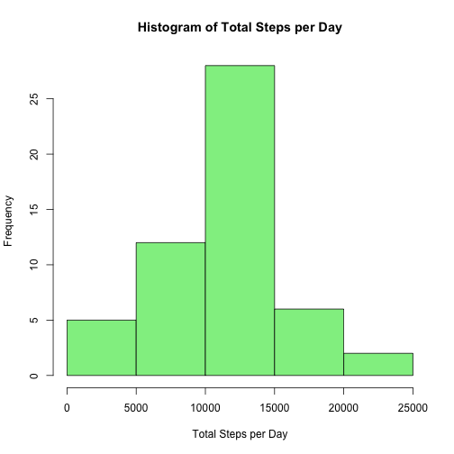

***
## 1. Loading and preprocessing the data
The code below reads the source file into memory in full fidelity and creates a copy of the source file with NA values removed.

```r
# Read source file into memory (17568 rows)
activity_file <- read.csv("activity.csv")

# Remote NAs from dataset (15264 rows)
cleaned_activity_file <- na.omit(activity_file)
```

## 2. What is mean total number of steps taken per day?
The code below calculates the total number of steps taken per day, using a copy of the source file with NA values removed.  A histogram is plotted displaying the frequency of steps across the intervals of the day.  


```r
# Calculate the total number of steps per day.
total_steps_per_day <- summarise(group_by(cleaned_activity_file, date), total_steps = sum(steps))

# Calculate mean of total steps per day. (10766.19)
mean_total_steps_per_day <- mean(total_steps_per_day$total_steps)
#mean_total_steps_per_day  <- round(mean_total_steps_per_day,2)

# Calculate median of total steps per day. (10765)
median_total_steps_per_day <- median(total_steps_per_day$total_steps)

# Plot histogram of total steps per day.
with(total_steps_per_day, hist(total_steps, main = "Histogram of Total Steps per Day", xlab = "Total Steps per Day", col = "light green"))
```

 

The mean of the total steps per day 1.0766189 &times; 10<sup>4</sup> and the median of the total steps per day 10765 are also calculated.

## 3. What is the average daily activity pattern?
The code below calculates the average number of steps per day and plots this using a line graph.  


```r
# Calculate the average number of steps per day.
mean_total_steps_per_interval <- summarise(group_by(cleaned_activity_file, interval), average_steps = mean(steps))

# Return the highest average interval by ordering average time and extracting the interval - 08:35
highest_interval <- paste("0", head(mean_total_steps_per_interval[order(mean_total_steps_per_interval$average_steps, decreasing = TRUE),], 1)$interval, sep="")

with(mean_total_steps_per_interval, plot(interval, average_steps, type = "l", col="green", main = "Average Daily Activity Pattern", xlab = "Hours of the Day", ylab = "Average steps across all days"))
axis(side=1, at=seq(0, 2355, by=500))
```

 


The interval with the highest number of steps - 0835 - is also calculated.


## 4. Imputing missing values
The code below imputes the missing values in the original full fidelity dataset by assigning the average number of steps per day, rounded to the nearest whole step.


```r
# Count the number of rows with NA values in them: 2304
observations_with_nas <- sum(!complete.cases(activity_file))

# Replace any NA values with the mean value for that interval, rounded to the nearest step.
imputed_activity_file <- activity_file
for(i in 1:nrow(activity_file)) {
    if(is.na(activity_file[i,]$steps)){ 
        imputed_activity_file[i,]$steps <- as.integer(round(subset(mean_total_steps_per_interval, select = c(average_steps), interval == activity_file[i,]$interval), digits = 0) )}
}

# Calculate the total number of imputed steps per day.
total_imputed_steps_per_day <- summarise(group_by(imputed_activity_file, date), total_steps = sum(steps))


# Calculate mean of total imputed steps per day. (10765.64)
mean_total_imputed_steps_per_day <- mean(total_imputed_steps_per_day$total_steps)

# Calculate median of total imputed steps per day. (10762)
median_total_imputed_steps_per_day <- median(total_imputed_steps_per_day$total_steps)

# Plot histogram of total imputed steps per day.
with(total_imputed_steps_per_day, hist(total_steps, main = "Histogram of Total Imputed Steps per Day", xlab = "Total Imputed Steps per Day", col = "light green"))
```

 

The mean of the total steps per day 1.0765639 &times; 10<sup>4</sup> and the median of the total steps per day 10762 are also calculated.  It can be observed that both the mean and the median have slightly decreased in comparison to the mean and median values from the copy of the source dataset with NA values removed.

## 5. Are there differences in activity patterns between weekdays and weekends?
The code below creates two factors for the weekend and weekday and two line graphs are created plotting the average number of steps across weekdays and weekends for each interval.  It can be observed that fewer steps are taken during weekday intervals in comparison to weekend intervals, one reason for such could be due to the sedentary nature of weekday professions.


```r
# Calculate the type of day.
weekend <- "Weekend"
weekday <- "Weekday"
imputed_steps_per_day_with_day_type <- imputed_activity_file
imputed_steps_per_day_with_day_type$day_type <- ifelse(weekdays(as.Date(imputed_activity_file$date)) == "Sunday", weekend, ifelse(weekdays(as.Date(imputed_activity_file$date)) == "Saturday", weekend, weekday))

# Calculate the total number of imputed steps per day.
mean_imputed_steps_per_day_with_day_type <- summarise(group_by(imputed_steps_per_day_with_day_type, interval, day_type), mean_steps = mean(steps))

xyplot(mean_imputed_steps_per_day_with_day_type$mean_steps ~ mean_imputed_steps_per_day_with_day_type$interval | mean_imputed_steps_per_day_with_day_type$day_type, mean_imputed_steps_per_day_with_day_type, col="green", layout = c(1, 2), type = "l", xlab = "Interval", ylab = "Steps", par.settings = list(strip.background=list(col="lightgrey")))
```

 
